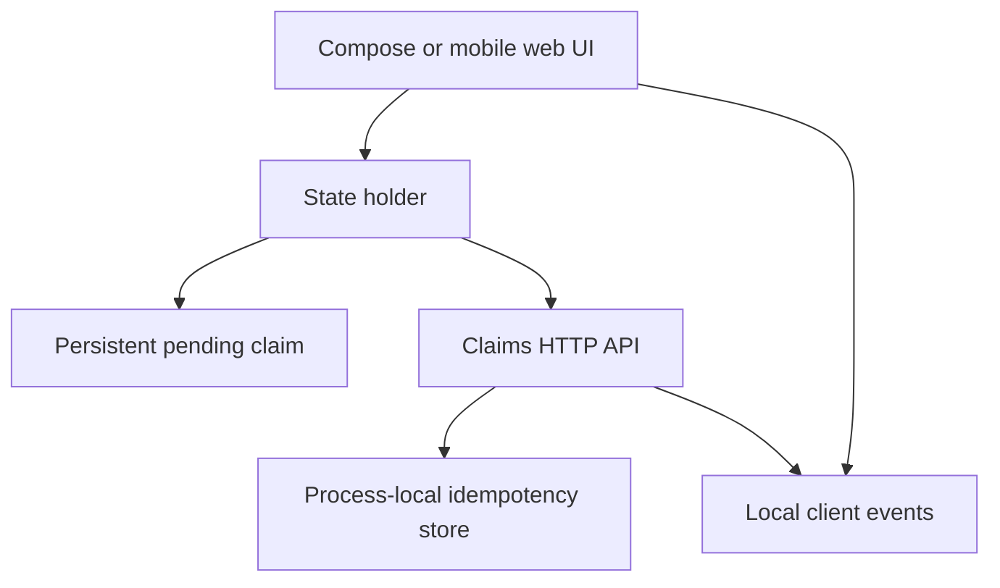
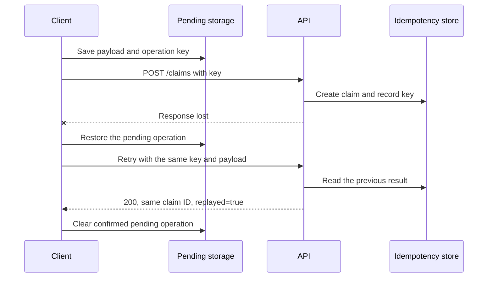
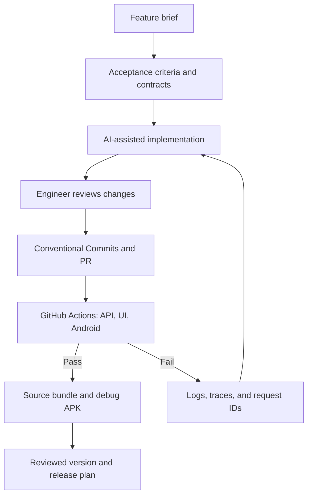
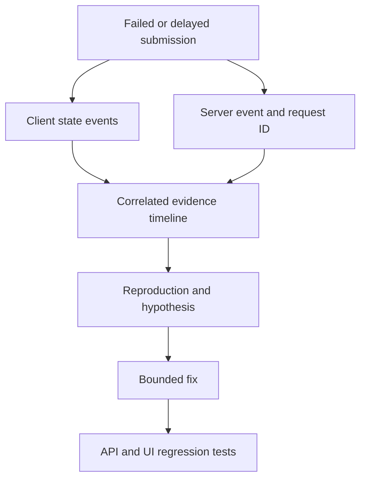

# AI-Assisted Mobile Engineering Playbook

**Moin Omer Habib · Senior Mobile Engineer**

A practical collection of reusable agent skills, engineering diagrams, and an expense-claims demo showing how AI can support planning, implementation, testing, review, debugging, and delivery.

**Kotlin / Jetpack Compose · Node.js · GitHub Actions · Conventional Commits · UI & API testing · Telemetry debugging**

This is a personal engineering project. AI helps prepare changes; contracts, human review, and automated checks provide the evidence for accepting them. No production performance or productivity gains are claimed.

## Start here

| Explore | What you will find |
| --- | --- |
| [Reusable skills](skills/) | Six focused workflows and one end-to-end coordinator |
| [Working demo](demo/) | Mobile-friendly web client and local Node.js HTTP API |
| [Native Android](android/) | Kotlin/Compose client, JVM amount tests, and Compose UI tests |
| [API contract](docs/api-contract.json) | OpenAPI request shapes, response statuses, and idempotency rules |
| [Engineering walkthrough](docs/walkthrough.md) | Decisions, trade-offs, AI contribution, and test mapping |
| [CI workflow](.github/workflows/ci.yml) | API, UI, Android lint/build/tests, commit validation, artifacts |
| [PR template](.github/pull_request_template.md) | Problem, verification evidence, AI contribution, and release recovery |
| [Verification record](docs/verification.md) | Executed checks and limitations, separate from configured workflows |

## Run the demo

Use Node.js 22 or newer:

```sh
npm ci
npm start
```

Open **http://127.0.0.1:3000**. Enter an expense, disable network access, submit, then restore connectivity and retry. Refresh before retrying to verify pending-state restoration. The original operation key survives the retry.

```sh
npm run lint
npm test
npx playwright install chromium
npm run test:ui
npm run build
```

The mobile browser tests use a Chromium Pixel 7 viewport. They cover real HTTP submission, offline/reload recovery, loading behavior, two-tab ownership, unavailable storage, and a server-accepted write whose response is deliberately lost. The browser demo requires Web Locks support to serialize writes across tabs.

### Native Android

Open `android/` in Android Studio with JDK 17 and Android SDK 35. Use Gradle 8.11.1 (CI installs it explicitly):

```sh
cd android
gradle testDebugUnitTest lintDebug assembleDebug
gradle connectedDebugAndroidTest
```

The debug app connects to the host API through **10.0.2.2:3000** in the Android emulator. Debug-only cleartext traffic is enabled for the local service. The server binds to localhost. A physical device requires a separately reviewed network setup. The Android demo stores one pending claim in SharedPreferences; the browser client uses localStorage. Compose UI tests inject state and callbacks, while the Node tests exercise the real API.

## Architecture



The operation key is saved before network I/O. A retry uses the same key and payload. Server-side idempotency is atomic only inside a single running Node process; a production system needs durable, transactional storage across instances.

## Safe retry after a lost response



## From requirement to delivery



The tag workflow verifies and packages a source bundle. It does not deploy a backend, sign a production app, or publish to Google Play. Android artifacts are generated only if the Android job succeeds.

## Analytics-assisted debugging



This demo emits structured local events, not a live production analytics integration. It intentionally excludes claim amounts, tokens, and personal details. See [telemetry guidance](docs/telemetry.md) for mapping the approach to Crashlytics, Firebase Analytics, Segment, or another approved monitoring system.

## Reusable skills

| Skill | Expected result |
| --- | --- |
| `plan-mobile-feature` | Acceptance criteria, edge cases, task plan, test mapping |
| `design-mobile-contracts` | State ownership, repository/API contracts, retry invariants |
| `review-mobile-change` | Prioritized findings with reproduction and verification |
| `verify-mobile-delivery` | Given–When–Then unit, UI, and API tests with evidence |
| `debug-with-telemetry` | Observations, hypotheses, correlation, and verified fix |
| `ship-with-github-actions` | Conventional Commits, PR, CI checks, artifacts, release plan |
| `mobile-engineering-workflow` | Coordination of the full delivery workflow |

Copy selected skill folders into the skill directory supported by your coding agent. For Codex, use `~/.codex/skills/`. These are agent instructions, not an embedded model or automatic runtime orchestration framework. Use `$mobile-engineering-workflow` to start an end-to-end task, or invoke a focused skill directly.

## Scope and limitations

- Educational fixed bearer token; replace with real identity and authorization before deployment.
- In-memory server data and operation keys reset on restart; no multi-instance durability or retention guarantee.
- One pending claim per client; no background synchronization or multi-device conflict resolution.
- Browser UI tests and Compose state tests cover different boundaries; neither implies production-device coverage.
- Production deployment, managed analytics, app signing, and Play publishing are outside this version.

## Author

[Portfolio](https://omerhabib26.github.io/) · [LinkedIn](https://www.linkedin.com/in/omerhabib/) · [GitHub](https://github.com/omerhabib26)

## References

### Inspiration and attribution

[Lennon Petrick's android-engineering-skills](https://github.com/lennonpetrick/android-engineering-skills) inspired the separation of Android architecture, reactive implementation patterns, and testing guidance. The reference is MIT-licensed, copyright 2026 Lennon Spirlandelli. The instructions and demo in this project were authored independently; upstream source files are not vendored.

This playbook extends that organization to API contracts, safe offline writes, PR creation, Conventional Commits, GitHub Actions, UI/API testing, and telemetry-based debugging. It preserves existing project conventions rather than mandating one DI library or JUnit version. See the [Android design reference](skills/design-mobile-contracts/references/android-design.md) and [Android testing reference](skills/verify-mobile-delivery/references/android-testing.md).

The upstream README also points to [Google's Android skills](https://github.com/android/skills) for focused Android tooling tasks. Those skills are not bundled or claimed as this project's implementation.

- [GitHub Actions documentation](https://docs.github.com/en/actions)
- [Playwright web server configuration](https://playwright.dev/docs/test-webserver)
- [Android Compose compiler configuration](https://developer.android.com/develop/ui/compose/setup-compose-dependencies-and-compiler)
- [Conventional Commits specification](https://www.conventionalcommits.org/en/v1.0.0/)
