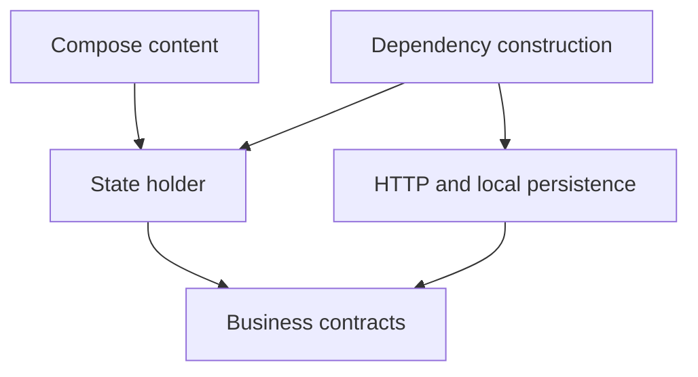

# Android architecture and reactive state

## Placement and dependencies

Inspect the existing architecture before creating packages or modules. Organize related code by feature; separate rendering, state coordination, pure business contracts, and external data access where that separation improves ownership or tests.

| Responsibility | Suitable boundary |
| --- | --- |
| Compose rendering and callbacks | UI |
| Screen state and action coordination | Presentation |
| Pure rules, models, and repository interfaces | Domain |
| HTTP, database, DTO mapping, and synchronization | Data |
| Construction and dispatcher wiring | DI/composition root |

Keep pure domain contracts free of Android and transport types. Prefer constructor-provided dependencies for testability; preserve an established Hilt, Koin, or manual factory setup instead of forcing a migration. Keep implementation visibility narrow. Avoid catch-all utility packages.

## State and Flow

Expose read-only state and send user actions through callbacks. Model meaningful states and transitions explicitly; avoid independent flags that allow invalid combinations. Preserve durable outcomes in state or storage instead of assuming a transient event will reach a collector.

Collect Compose state with lifecycle-aware APIs. Choose Flow operators by cancellation semantics: use latest-wins switching for replaceable reads, and explicit serialization or a durable queue for writes that must not be discarded. Do not introduce StateFlow operators or shared subscriptions without understanding equality and replay behavior.

Inject dispatchers for code that needs coroutine testing. Propagate cancellation. Map recoverable transport/storage failures to explicit contract errors and describe which errors permit retry. Do not expose DTOs or HTTP response wrappers directly to UI code.

## Diagram convention

This is guidance for feature growth, not a claim that the small demo has a multi-module architecture, Hilt, Retrofit, or Room. Document any deliberate simplification.

## Example review prompt

“Inspect this expense feature's state ownership, repository interface, retry rules, and cancellation. Recommend the smallest changes that clarify boundaries, then show which tests verify them.”
